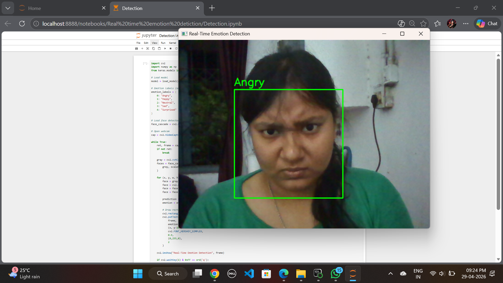
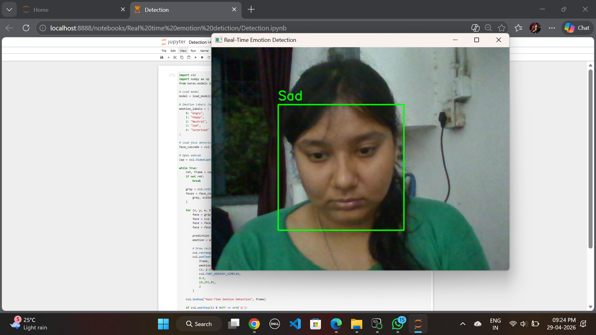
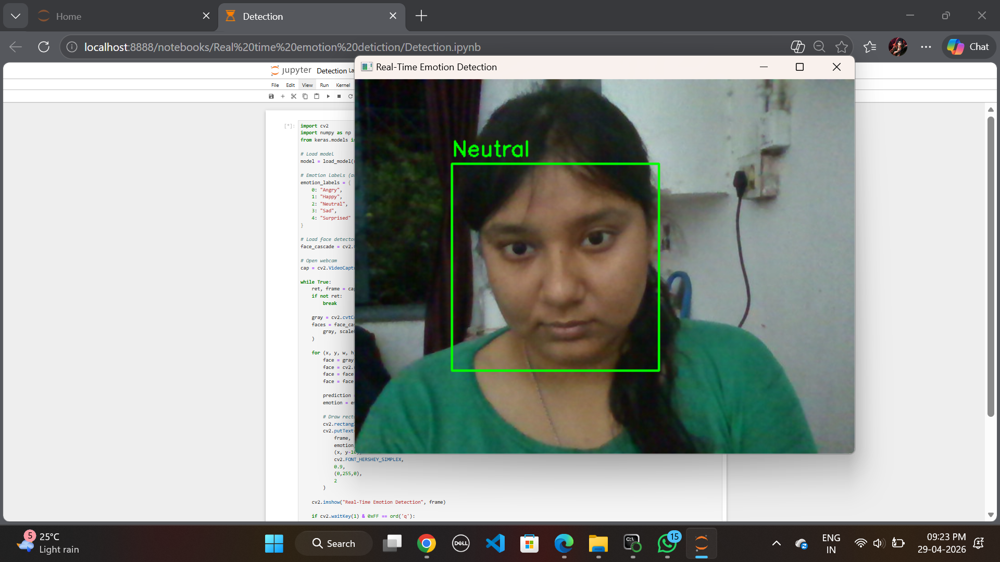
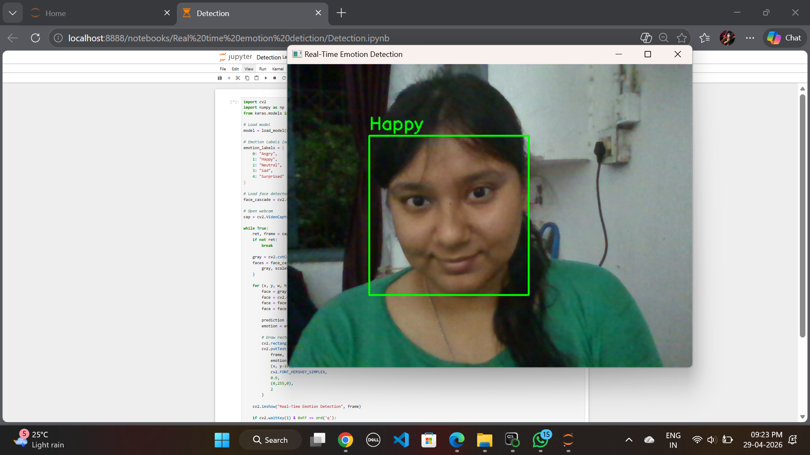

# Real-Time-Emotion-Detection

##  Overview
This project detects human emotions in real-time using a webcam.

##  Technologies Used
- Python
- OpenCV
- Deep Learning (CNN)
- TensorFlow / Keras

##  Features
- Real-time face detection
- Emotion classification (Happy, Sad, Angry, etc.)
- Live webcam integration

##  How to Run
1. Install dependencies
2. Run:
   python main.py

##  Output
(Add screenshots here)

## Project Structure
- main.py
- model.h5
- utils.py

## Output

## Author
Pragati Sarkar
